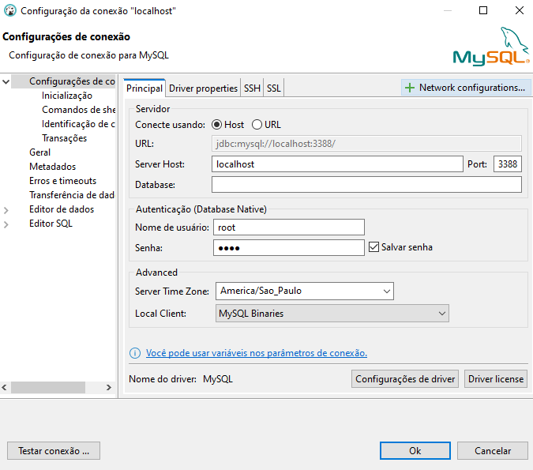

# Setup Docker Laravel 10 com PHP 8.2.9

### Passo a passo
Clone Repositório
```sh

git clone https://github.com/cassioleguizamonbueno/curso-de-laravel-10.git app-laravel
```
```sh
cd app-laravel
```


Crie o Arquivo .env
```sh
cp .env.example .env
```


Atualize as variáveis de ambiente do arquivo .env
```dosini
APP_NAME=Laravel
APP_ENV=local
APP_KEY=base64:YuwRNagO4LAYn2hHhaxCs6sheT0uPf8PYWWBZDfdYMY=
APP_DEBUG=true
APP_URL=http://localhost:8989

LOG_CHANNEL=stack
LOG_DEPRECATIONS_CHANNEL=null
LOG_LEVEL=debug

DB_CONNECTION=mysql
DB_HOST=db
DB_PORT=3306
DB_DATABASE=laravel
DB_USERNAME=root
DB_PASSWORD=root

BROADCAST_DRIVER=log
CACHE_DRIVER=file
FILESYSTEM_DISK=local
QUEUE_CONNECTION=sync
SESSION_DRIVER=file
SESSION_LIFETIME=120

MEMCACHED_HOST=127.0.0.1

REDIS_HOST=127.0.0.1
REDIS_PASSWORD=null
REDIS_PORT=6379

MAIL_MAILER=smtp
MAIL_HOST=mailpit
MAIL_PORT=1025
MAIL_USERNAME=null
MAIL_PASSWORD=null
MAIL_ENCRYPTION=null
MAIL_FROM_ADDRESS="hello@example.com"
MAIL_FROM_NAME="${APP_NAME}"

AWS_ACCESS_KEY_ID=
AWS_SECRET_ACCESS_KEY=
AWS_DEFAULT_REGION=us-east-1
AWS_BUCKET=
AWS_USE_PATH_STYLE_ENDPOINT=false

PUSHER_APP_ID=
PUSHER_APP_KEY=
PUSHER_APP_SECRET=
PUSHER_HOST=
PUSHER_PORT=443
PUSHER_SCHEME=https
PUSHER_APP_CLUSTER=mt1

VITE_PUSHER_APP_KEY="${PUSHER_APP_KEY}"
VITE_PUSHER_HOST="${PUSHER_HOST}"
VITE_PUSHER_PORT="${PUSHER_PORT}"
VITE_PUSHER_SCHEME="${PUSHER_SCHEME}"
VITE_PUSHER_APP_CLUSTER="${PUSHER_APP_CLUSTER}"
```

Suba os containers do projeto
```sh
docker-compose up -d
```

Observacao
```
O banco sera criado automaticamente pelo docker
caso queira conectar após a subida dos containers 
O banco irá subir na porta 3388

```

Se precisar Build novamente os containers do projeto
```sh
docker-compose up -d --build
```

Acesse o container app se precisar rodar algum commando de php
```sh
docker-compose exec app bash
```


Instale as dependências do projeto
```sh
composer install
```


Gere a key do projeto Laravel
```sh
php artisan key:generate
```

Rode a migration com o commando abaixo para recriar todos os dados da base 
```sh
php artisan migrate:fresh
```


Acesse o projeto
[http://localhost:8989](http://localhost:8989)
